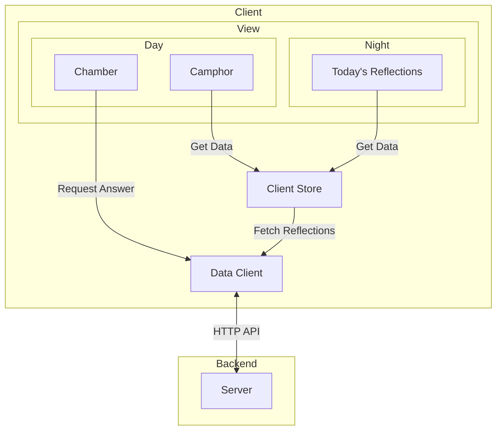

# Moonlight

_Learn in Day, Review in Night._

Nowadays, with extremely powerful AI tools, individuals are able to search and filter the massive, ever-growing world of information to gain specific knowledge of interest. This dramatically helps individuals learn quickly without digging through useless information. However, knowledge that comes quickly can be lost even quicker. A platform is required to assist people in learning by day, then highlighting and summarizing by night, so that they can review and consolidate memories.

This is not a tool to build a to-do list and remind you of tasks. It is for self-driven people who proactively learn and are eager to review what they have learned.

## System Design

Robust Optimistic UI will be implemented for better user experience.

### Architecture



#### Component Responsibilities

- **Server:** Provides HTTP APIs to provide answer, create a new reflection, and fetch today's reflections.
- **Data Client:** Makes network requests to server.
- **Client Store:** Stores data across the whole application and control the flow of data.
- **Day:** Contains **Camphor** (list of recent reflections) and **Chamber** (UI for creating new reflections).
- **Night:** Contains a list of reflections for today.
- **Reflection:** Contains a series of questions and answers.

### Rendering Approach

SSR with (Re)hydration. HTML, CSS, and js are loaded from server when neccessary with React Server Components and Next.js.

### Data Model

Today's reflections show a list of reflection items from the server, hence most of the data involved in this application will be server-originated data. The client-side data needed is the form state for input files in chamber, and a list of most recent reflections.

| Entity            | Source                              | Belongs To                  | Fields                                        |
| :---------------- | :---------------------------------- | :-------------------------- | :-------------------------------------------- |
| **Reflections**   | Server                              | Night (Today's Reflections) | `entries`(a list of Reflection), `pagination` |
| **Reflection**    | Server                              | Reflection                  | `id`, `label`, `traces`, `owner_id`           |
| **Trace**         | Server                              | Reflection                  | `id`, `created_time`, `q`, `a`,               |
| **User**          | Server                              | Client Store                | `id`, `name`                                  |
| **NewReflection** | Mix of User Input and Server Answer | Chamber                     | `label`, `trackes`                            |
| **Camphor**       | Mix of User Input and Server Answer | Camphor                     | a list of Reflections                         |

Although the Reflections belong to Today's Reflections, all server-originated data can be stored in the client store and queried by the components which need them.

The shape of the client store will be defined later, and **Unified Rich Timeline (URT)** will be used to fetch Reflections, **Normalised Store** will be implemented as well.

### Endpoint API

#### Fetch Reflections

| Field       | Value                                                            |
| :---------- | :--------------------------------------------------------------- |
| Endpoint    | GET /reflections                                                 |
| Description | Fetch Reflections, cursor pagination, traces will be fetch later |
| Queries     | `user_id`, `counts`, `cursor`                                    |

Sample Response

```json
{
  "pagination": {
    "size": 10,
    "cursor": ""
  },
  "entries": [{ "id": "", "owner_id": "", "trace_ids": ["", "", "", ""] }]
}
```

#### Fetch Traces

| Field       | Value                                          |
| :---------- | :--------------------------------------------- |
| Endpoint    | GET /traces                                    |
| Description | Fetch traces, cursor pagination                |
| Queries     | `user_id`, `reflection_id`, `counts`, `cursor` |

Sample Response

```json
{
  "pagination": {
    "size": 10,
    "cursor": ""
  },
  "entries": [{ "id": "", "created_time": 10101010, "q": "", "a": "" }]
}
```

#### Create Reflection

| Field       | Value                    |
| :---------- | :----------------------- |
| Endpoint    | POST /reflection         |
| Description | Creates a new reflection |

Request Body

```json
{
  "label": "Auto-generated or User-defined Label",
  "traces": [
    {
      "q": "User Question",
      "a": "AI Answer",
      "created_time": 1715629472
    }
  ]
}
```

#### Request Answer

| Field       | Value                                  |
| :---------- | :------------------------------------- |
| Endpoint    | GET /answer                            |
| Description | Request an answer                      |
| Queries     | `user_id`, `reflection_id`, `question` |

Sample Response

```json
{
  "reflection_id": "", // could be the same as in queries, or if missing from queries, a new one will present, ui should use it for following questions, otherwise server will create a new session
  "question": "",
  "answer": ""
}
```
