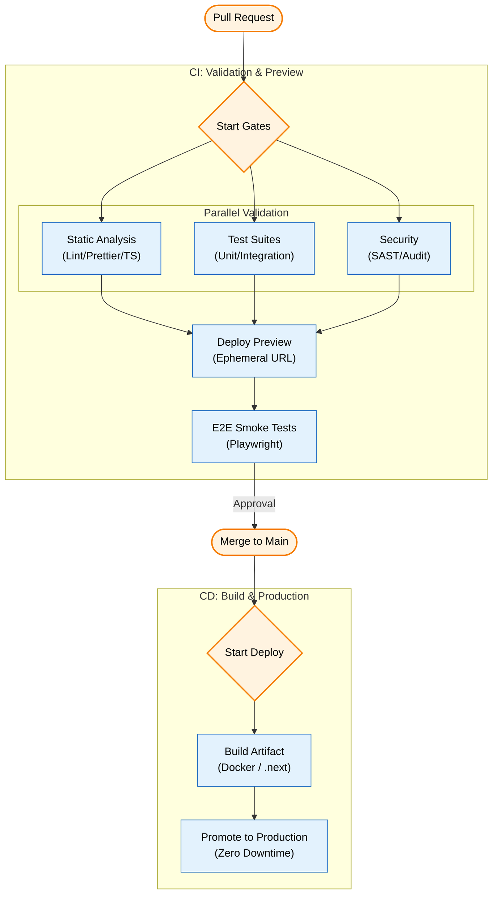
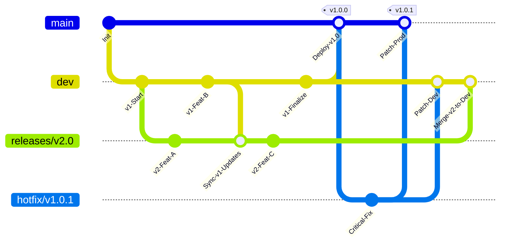

# Product Readiness Checklist: Core Architecture & Design

## 1. System Architecture

- **Framework:** Next.js (App Router, react-compiler)
- **Rendering Model:** Hybrid (Server Components + Client Components) with Streaming.
- **Architectural Style:** Modular Monolith / Micro-Frontend (Logical separation by feature domain).
- **Development Methodology:** Component-Driven Development (CDD).
- **Project Structure:** Feature-Based Folder Structure (Colocation of logic, UI, and tests).

## 2. Feature Modules & Rendering Strategies

The application consists of three primary domains, each optimized for specific performance metrics and user interaction patterns.

### A. Chamber (Interaction Layer)

**Domain:** Real-time user input (Q&A) and dynamic AI responses.
**Optimization Goal:** minimize Interaction to Next Paint (INP) and preserve main thread responsiveness.
**Rendering Strategy:** **Client Components with Server Actions (Streaming)**.

- **Why:** While the initial shell is server-rendered for immediate First Contentful Paint (FCP), the rich interactivity of typing and chat management requires client-side state. We utilize Server Actions to stream AI responses directly into the client component, avoiding heavy client-side fetching waterfalls.
- **Key Metrics:** INP, TTI (Time to Interactive).

### B. Camphor (Preservation Layer)

**Domain:** Feeds of recent reflections and topic-based updates.
**Optimization Goal:** Immediate shell visibility and progressive data loading.
**Rendering Strategy:** **Server Components (RSC) with Suspense Streaming**.

- **Why:** The generic layout should load instantly (low TTFB). The dynamic list of reflections, which may involve longer database queries, is wrapped in React Suspense boundaries. This allows the server to send the HTML shell immediately and stream the content list as soon as it's ready, preventing the page from blocking.
- **Key Metrics:** FCP (First Contentful Paint), LCP (Largest Contentful Paint).

### C. Moonlight (Review Layer)

**Domain:** Daily summarization and review dashboard.
**Optimization Goal:** Data completeness and visual stability.
**Rendering Strategy:** **Server Components (RSC) with Suspense Streaming**.

- **Why:** Similar to Camphor, this is a read-heavy view. We prioritize rendering the dashboard layout on the server to reduce client-side JavaScript bundle size. Charts and interactive elements will be isolated Client Components ("Islands") hydrated only when visible or necessary.
- **Key Metrics:** TBT (Total Blocking Time), CLS (Cumulative Layout Shift).

## 3. Automated Quality Gates

We enforce code quality early in the development lifecycle ("Shift Left") to prevent technical debt and runtime errors.

- **Formatting & Style:** **Prettier** (Auto-formatting) + **EditorConfig**.
- **CSS Assurance:** **Tailwind CSS**.
  - **Sorting:** `prettier-plugin-tailwindcss` enforces consistent class ordering automatically on save.
  - **Linting:** `eslint-plugin-tailwindcss` (currently v4 Beta).
    - Detects conflicting classes (e.g., declaring `p-4` and `p-6` on the same element).
    - Validates utility names against the Tailwind configuration to catch typos.
    - **Strategy:** We rely on strict compile-time linting to prevent styling collisions rather than incurring the runtime performance cost of `tailwind-merge` or `cn` utilities.
- **Static Analysis:** **ESLint** (React/Next.js best practices, accessibility rules).
- **Type Safety:** **TypeScript** (Strict mode enabled, no `any`).
- **Pre-commit Hooks:** **Husky** + **lint-staged**.
  - Ensures all staged files pass linting and formatting.
  - **Secret Scanning:** Prevents accidental credential commits.

## 4. Test Strategy

We follow the "Testing Trophy" approach, prioritizing integration confidence over granular unit isolation.

- **Unit Tests:** **Jest**. Focus on utility functions, custom hooks, and complex business logic algorithms.
- **Component/Integration Tests:** **React Testing Library**. Focus on user interactions, accessibility (a11y), and rendering states (loading/error) by mocking data layers.
- **End-to-End (E2E) Tests:** **Playwright**. Focus on critical user journeys (Authentication, Core "Chamber" flow, "Moonlight" dashboard). Coverage is limited to stable, high-value paths to avoid maintenance fatigue.

## 5. CI/CD Pipeline

The pipeline ensures that every commit is verifiable and every deployment is reproducible.

### A. Pipeline Workflow (GitHub Actions)

1.  **Validation (On Pull Request)**
    - **Static Checks:** Parallel execution of Lint, Prettier, and TypeScript compilation.
    - **Tests:** Run Unit and Integration suites.
    - **Security:** SAST (Static Application Security Testing) and dependency auditing (e.g., `npm audit`, Snyk).

2.  **Preview Environment (Ephemeral)**
    - **Deploy:** Automatic deployment to a temporary URL (Vercel Preview / Netlify).
    - **E2E Smoke Tests:** Playwright runs against the _live_ preview URL to verify critical paths work in a realistic environment.

3.  **Build & Artifact (On Merge to Main)**
    - **Build Once, Deploy Many:** Generate the production artifact (Docker image or `.next` standalone build) once. Configuration is injected at runtime via environment variables.

4.  **Production Deployment**
    - **Promotion:** The verified artifact is promoted to the production environment.
    - **Zero Downtime:** Rolling updates or Blue/Green deployment strategy.

### B. Visual Pipeline Workflow



## 6. Git Branching Strategy

We utilize a rigorous **GitHub Flow** enhanced with environmental stages to ensure stability while allowing parallel development of future versions and emergency maintenance.

### A. Branch Definitions

- **`main` (Production):**
  - **Source of Truth:** The live production code.
  - **Protection:** Strict blocking. No direct commits allowed. Requires PR merge.
  - **Tagging:** Automated Semantic Versioning tags (e.g., `v1.2.0`) are generated upon every merge.

- **`dev` (Development):**
  - **Integration Hub:** The default target for today's work and the current release candidate.
  - **Protection:** No direct commits. Requires reviews and passing CI.

- **`feat/*` (Feature Work):**
  - **Scope:** Short-lived branches for a single user story, bug fix, or task.
  - **Lifecycle:** Branched from `dev`, implemented, and merged back into `dev` via Pull Request. Deleted after merge.

- **`hotfix/*` (Critical Maintenance):**
  - **Scope:** Emergency patches for production incidents that cannot wait for the next release cycle.
  - **Strategy:** Branched from `main`, fixed, and merged into **both** `main` (patch prod) and `dev` (prevent regression).

- **`releases/*` (Parallel Future Development):**
  - **Scope:** A temporary workspace for the _next_ major version (e.g., `releases/v2.0`) while the current version (v1.x) is still being finalized on `dev`.
  - **Maintenance:** Must regularly **sync (rebase/merge)** from `dev` to consume bug fixes and prevent conflict accumulation.
  - **Exit Strategy:** Once the current release (v1.x) ships to `main`, this branch merges back into `dev` and is deleted.

### B. Governance Rules

1.  **Platform:** GitHub is the single command center.
2.  **Protection Rule:** `main` and `dev` enforce:
    - **Require Pull Request Reviews:** At least 1 approval.
    - **Require Status Checks:** CI (Build/Test/Lint) must pass.
    - **No Direct Pushes:** All changes come via PR.

### C. Workflow Visualization



## 7. Performance & Observability

### A. Optimization

#### 1. Lazy Loading & Resource Prioritization

Beyond component-level lazy loading (`next/dynamic`), we optimize resource delivery to improve Core Web Vitals (LCP/TBT).

- **Images:** Strict usage of **`next/image`**.
  - Automatically lazy-loaded.
  - Requires explicit `width`/`height` to prevent Layout Shift (CLS).
  - Use `priority` only for the LCP element (e.g., hero image).
- **Third-Party Scripts:** Use **`next/script`** to defer non-critical JS.
  - `strategy="lazyOnload"` for lower priority scripts (e.g., Chat widgets, Feedback forms).
  - `strategy="afterInteractive"` for tracking tags (Analytics).
- **Lazy Functions (Dynamic Imports):**
  - Don't import heavy utility libraries (like `jspdf`, `xlsx`, or heavy crypto) at the top level if they are mainly used in event handlers.
  - **Pattern:** `const { generatePDF } = await import('@utils/pdf');` inside the `onClick` handler.

#### 2. Tree shaking

Enforce Modular import, avoid "Barrel Files" for large libraries. A "barrel file" is an index.ts that re-exports everything(Example shown as below), which can _de-opt_ tree shaking in some scenarios, causing the bundler to process files you aren't using.

```typescript
// components/index.ts
export * from "./Button";
export * from "./Table";
export * from "./Modal"; // ...and 50 others
```

For huge 3rd-party libraries (like lodash or heavy UI libraries) that don't support ESM tree shaking well, you can configure next.config.js to rewrite imports automatically:

```js
/* next.config.mjs */
const nextConfig = {
  modularizeImports: {
    "lucide-react": {
      transform: "lucide-react/dist/esm/icons/{{member}}",
    },
  },
};
```

This forces import { Home } from 'lucide-react' to become import Home from 'lucide-react/dist/esm/icons/home', ensuring you only bundle the one icon.

#### 3. Code Splitting

Next.js handles most code splitting automatically (route-based), but manual intervention is required for optimization at a granular level.

- **Route Segments:** Each `page.tsx`, `layout.tsx`, and `loading.tsx` is automatically split.
- **Client Component Islands:** Moving interaction to leaf nodes (button, input) keeps the parent Server Component payload small, effectively splitting "interactive" code from "static" HTML generation.
- **Granular Splitting:** Use `import('package')` for heavy logic that isn't needed immediately (e.g., parsing a complex file format only after file upload).

### B. Monitoring

#### 1. Performance & Real User Monitoring (RUM)

Synthetic tests (Lighthouse) are not enough. We monitor actual user experiences in production.

- **Vercel Speed Insights (or Google CrUX):** Tracks Core Web Vitals (LCP, INP, CLS) across different devices and regions in real-time.
- **Route Change Profiling:** Identifying slow page transitions or navigation events that degrade the user journey.

#### 2. Error Tracking & Observability

- **Sentry:** Captures unhandled exceptions on both Client and Server.
  - **Source Maps:** Uploaded during build to de-obfuscate production stack traces.
  - **Release Health:** Tracks crash-free sessions percentage per deployment.
- **Session Replay (LogRocket/Sentry):** Visual reproduction of user interactions leading up to an error, essential for debugging "Chamber" chat interactions.

## 8. Theming Strategy

We use a **CSS custom property + Tailwind semantic token** approach so that adding or changing a theme only requires editing `globals.css` — zero component changes needed.

### A. Architecture

```
globals.css  ──►  :root / [data-theme]  ──►  @theme inline  ──►  Tailwind classes in JSX
```

All colors are defined as CSS custom properties in `globals.css` and exposed to Tailwind via `@theme inline`. Components **only** ever use semantic Tailwind classes — never raw palette classes like `bg-zinc-50` or hardcoded hex values like `#383838`.

### B. Semantic Tokens

| CSS Variable          | Tailwind Class           | Purpose                                       |
| --------------------- | ------------------------ | --------------------------------------------- |
| `--background`        | `bg-background`          | Page-level background                         |
| `--foreground`        | `text-foreground`        | Primary body text                             |
| `--foreground-strong` | `text-foreground-strong` | High-emphasis headings & labels               |
| `--foreground-hover`  | `bg-foreground-hover`    | Hover state on filled (foreground BG) buttons |
| `--surface`           | `bg-surface`             | Subtle background, outer wrappers             |
| `--surface-elevated`  | `bg-surface-elevated`    | Cards, panels, raised containers              |
| `--surface-hover`     | `bg-surface-hover`       | Hover state on outlined / ghost elements      |
| `--muted`             | `text-muted`             | Subdued text (descriptions, captions)         |
| `--border`            | `border-border`          | Borders and dividers                          |

### C. Theme Switching

Each token is defined **once** using the CSS `light-dark()` function. The active variant is controlled entirely by the `color-scheme` property — no duplicated values, no `@media` fallback blocks needed:

```css
:root {
  color-scheme: light dark;
} /* respects system preference */
[data-theme="light"] {
  color-scheme: light;
} /* force light */
[data-theme="dark"] {
  color-scheme: dark;
} /* force dark */
```

Themes are applied by setting the `data-theme` attribute on `<html>`. When no attribute is set, the browser's system preference is used automatically.

### D. Adding a New Theme

To add a new theme (e.g. a high-contrast or brand theme), only touch `globals.css`:

1. Add a `[data-theme="your-theme"]` block that overrides the CSS variables directly (without `light-dark()`).
2. Apply it via `<html data-theme="your-theme">` (server-side) or toggle the attribute with a client component.

No component file changes are required.

### E. Rule

> Any color that changes between themes → CSS variable → `@theme inline` → semantic Tailwind class.
> Never use a raw palette class (`bg-zinc-50`, `text-zinc-600`) or a hardcoded hex value in JSX.
